<h1 align="center">
  <a href="https://github.com/M-art-ucci">
    
  </a>
  <a href="https://discord.com/invite/9ZFdQH5YP6">
    
</h1>
<a href="https://tecnoblog.net/responde/como-usar-o-github-guia-para-iniciantes/">Como usar Github?</a>

# Guia de prompts para Stable Diffusion
  	
  <a href="[b27da3676739813c35aa2d6aac4bd6d1326a2a7b](https://github.com/M-art-ucci/Stable-Diffusion-pt-BR-Definitivo/commit/b27da3676739813c35aa2d6aac4bd6d1326a2a7b)](https://img.shields.io/badge/%C3%BAltima%20modifica%C3%A7%C3%A3o-12%2F11%2F2022-green">

### Baseado no livro [Stable Diffusion Prompt Book ](https://openart.ai/promptbook)
<div align="left"> E experimentações pessoais
</div>

---
<div>
<h3><details open><summary><b>Índice</b></summary>

   [1. O que é o Prompt (txt2img)](https://github.com/M-art-ucci/Guia-de-Prompts-para-Stable-Diffusion#o-que-%C3%A9-o-prompt-txt2img) <br>
   [2. O que é Engenharia de Prompt?](https://github.com/M-art-ucci/Guia-de-Prompts-para-Stable-Diffusion#o-que-%C3%A9-engenharia-de-prompt)<br>
   [3. Formato de Prompt](https://github.com/M-art-ucci/Guia-de-Prompts-para-Stable-Diffusion#formato-de-prompt)<br>
   [4. Modificadores de Prompt](https://github.com/M-art-ucci/Guia-de-Prompts-para-Stable-Diffusion#modificadores-de-prompt)<br>
   [5. Parâmetros de Geração de Imagem](https://github.com/M-art-ucci/Guia-de-Prompts-para-Stable-Diffusion#par%C3%A2metros-de-gera%C3%A7%C3%A3o-de-imagem)<br>
   [6. Geração de Imagens a partir de outra imagem (img2img)]()<br>

</div>
 
---
### O que é o Prompt (txt2img)
<div align="left">
    A caixa de prompt é onde você entra com uma descrição em linguagem natural para a geração de imagens a partir de um espaço latente em modelo treinado com inteligência artificial.
    <br><br>
    Em resumo: é o texto em inglês (língua usada para a criação do modelo) com as instruções para que uma imagem seja gerada.

---
### O que é Engenharia de Prompt
Essa é uma [possível futura área de atuação](https://www.linkedin.com/pulse/jobs-future-ai-prompt-engineer-cody-w-burns/?trk=public_post) dentro do universo de modelos geracionais. Um engenheiro de  prompt é um especialista que busca soluções para a construção de melhores resultados através de frases e modificadores.

Apesar de ser possível escrever os prompts em português, o modelo original foi treinado em inglês, e essa é o idioma ideal para se obter os resultados mais precisos.

Um bom prompt contém uma boa estrutura de frase e modificadores coerentes com o assunto, além de bons ajustes de parâmetros na interface.

Para este guia, alguns termos e frases vão conter sua versão em inglês, para facilitar o uso.

>to-do: criar extensão auxiliar para criar prompts em português e a tradução em inglês gerar a imagem

### Formato de Prompt

Comece escolhendo qual é o tipo de imagem a ser gerada.

    Exemplos: Fotografia (Photography), pintura (Painting), Escultura (Sculpture).


Escolha o objeto principal.

    Exemplos: Um homem (a man), uma mulher (a woman), um gato (a cat), uma cidade (a city).


Acrescente detalhes importantes para a imagem.

Tipo de iluminação (lighting)

    Exemplos: luzes neon (neon lights), luz ambiente (ambient light), iluminação de estúdio (studio lighting).

Local (environment)

    Exemplos: ambiente externo (outdoor), interno (indoor), debaixo d'água (underwater), no espaço (in space).

Esquema de cores (color scheme)

    Exemplos: vibrantes (vibrant), patéis (pastel), monocromática (monochromatic).
Ponto de vista (point of view)

    Exemplos: frontal (front), vista aérea (overview), lateral (side).

Fundo da imagem (background)

    Exemplos: cor sólida (solid color), florest (forest), montanhas (mountains).
Estilo da arte (art style)

    Exemplos: render 3D (3D render), Disney, cartaz de filme (movie poster).


A lista de opções é virtualmente infinita.

<details closed><summary>Links de sites com prompts para você se inspirar</summary>
<p>
Links
</p>
</details>
Contorno de tabela

<table><tr><td>
Exemplo:

1. É uma pintura ou fotografia?
    
    Pintura (Painting)

2. Qual é o objeto da foto? Pessoa, animal, terreno.

    b. Pessoa. Um homem velho (An old man)

3. Quais detalhes serão acrescentados?

    a. Lendo um jornal (reading a newspaper)

    b. Iluminação especial: luz natural (natural lighting)

    c. Ambiente: em um parque (in a park)

    d. Esquema de cores: Vibrantes (vibrant colors)

4. Qual é o estilo da pintura? Render 3D, Cubismo, Aquarela

    Aquarela (Watercolor)

A painting of an old man reading newspaper, natural lighting, in a park, vibrant colors, watercolor style

A ordem em que as palavras entram no prompt alteram o resultado.

A watercolor painting of an old man in a park, reading newspaper, natural lighting, vibrant colors
</td></tr></table>    

---
### Modificadores de Prompt
Os modificadores são palavras ou frases específicas que podem alterar diversas qualidades da imagem.


<details open><summary>Fotografia (Photography)</summary>

| Enquadramento (Shot) | Estilo (Style) | Objeto (Subject) | Iluminação (Lighting) | Contexto (Context) | Lente (Lens)| Equipamento (Device) | Resultado
| --- | --- | --- |---|---|---|--- |---
|Close-up | Monochromatic | Woman | Soft | Indoor | Wide-angle | Polaroid | 
|Extreme Close-up | Out of focus | Old man | Ambient|  Outdoor | Telephoto | Nikon Z FX | 
|POV| Long exposure | Grey cat | Ring|  At night | 24mm | CCTV |
|Medium shot | Color splash | Bunny | Sun | In the park | EF 70mm | Canon | 
|Long shot | Tilt-shift | Ferrari | Cinematic | Studio | Bokeh | Gopro | 

</blockquote></details>

<details open><summary>Desenho, Pintura e Recortes</summary>

| Giz(Chalk) | Graffiti | Aquarela (Watercolor) | Pintura a óleo (Oil Painting) | 
|---|---|---|---|
||||
A blackboard **chalk** painting of a samurai | overpass bridge **graffiti** art of a cyberpunk samurai | **Watercolor** painting of a cute samurai surrounded by cherry blossoms, detailed, intricate, synthwave style |**Oil painting** of human Rick Sanchez, contest winner

</blockquote></details>

<details open><summary>Escultura, Paper craft e Render 3D</summary>

| Crochê (Crochet) | Escultura em madeira (Wooden sculpture) | Origami | Render 3D (3D Render) | 
|---|---|---|---|
||||
A **crochet** of a cyberpunk samurai | **Wooden sculpture** bust of a cyberpunk samurai | **Origami** of a cyberpunk samurai | ((low poly)) cyberpunk samurai character, **3d isometric render**, dark background, ambient occlusion, unity engine

</blockquote></details>

<details open><summary>Artistas</summary>

A escolha do estilo de um artista pode mudar completamente a composição da imagem.
>Closeup of a ballerina by the window and a city skyline in the background, photography

| Ruth Bernhard | Peter Kemp | Ray Earnes | Janek Sedlar | 
|---|---|---|---|
||||

>Portrait of a cyberpunk samurai

| Derek Gomes | Miles Aldridge | Jean Baptiste-Carpeaux | Anne-Louis Girodet | 
|---|---|---|---|
||||

Misture estilos diferentes!

|A ballerina samurai, by **Miles Aldridge** | A ballerina samurai, by **Anne-Louis Girodet** | A ballerina samurai, by **Anne-Louis Girodet _and_ Miles Aldrigde** 
|---|---|---
|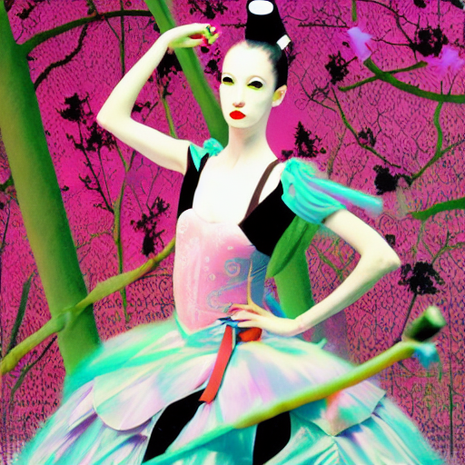|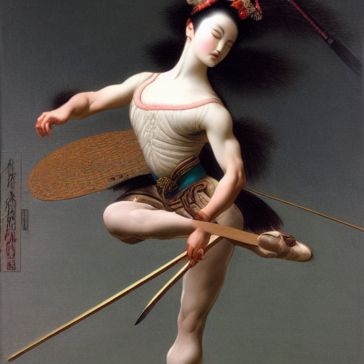|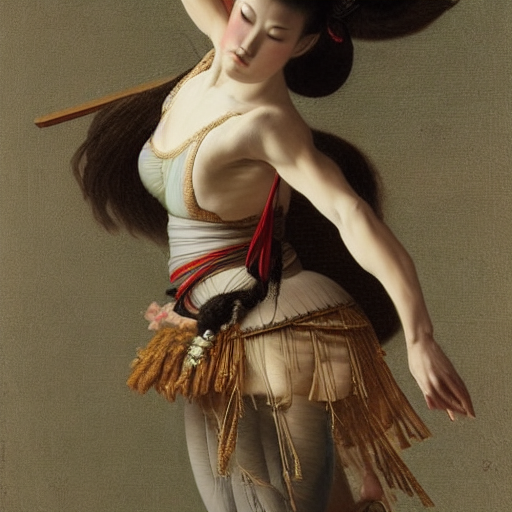

</blockquote></details>

<details open><summary>Lista de referências de artistas com seus estilos</summary>

1. [Lista de Artistas da Google](https://artsandculture.google.com/category/artist)

2. [Guia de Artistas Stable Art](https://proximacentaurib.notion.site/e28a4f8d97724f14a784a538b8589e7d?v=42948fd8f45c4d47a0edfc4b78937474)

3. [Coleção de Artistas reconhecidos pelo Stable Diffusion](https://sgreens.notion.site/sgreens/4ca6f4e229e24da6845b6d49e6b08ae7?v=fdf861d1c65d456e98904fe3f3670bd3)

4. [Lista de modificadores com exemplos](https://www.the-ai-art.com/modifiers)

</blockquote></details>

<details open><summary>Modificadores Especiais</summary>

Emoções positivas

|  |   |  |  | 
|---|---|---|---|
| Closeup photo of a beautiful **happy** woman wearing makeup, prairies, twilight, vivid colors, bokeh, highly detailed, award winning | A cat sleeping in the morning, **Cosy**, photography| **Romantic** cats cuddling, photography | Medium shot of a **joyful** cat in a rooftop at night,  photography

Emoções negativas

|  |   |  |  | 
|---|---|---|---|
|A **grim** city, photography | Extreme closeup of a woman, double exposure with city lights, night, **Gloomy**, photography| **Fear** in her eyes, photography | Extreme closeup photo of a refugee girl's green eyes, traditional clothes, side profile, looking at the camera, **sad** eyes, 50mm

<details open><summary>Modificadores Mágicos</summary>

Alta definição

|HDR | UHD | 64K |Highly detailed | 
|---|---|---|---|
||||
Digital art of a cyberpunk samurai, by wenjun lin, **HDR**, **UHD** | Digital painting portrait of a menacing cyberpunk samurai, **UHD**, Kentaro Miura | Portrait of a cyberpunk samurai, by wenjun lin, digital art, **UHD**, **64K** | Splash art of a cyberpunk samurai, moba game, **highly detailed**, Alberto Seveso

Profissionais

| Photo of a bee on a red flower |Professional photo of a bee on a red flower | A cool samurai sword | A cool samurai sword, studio lighting | 
|---|---|---|---|
|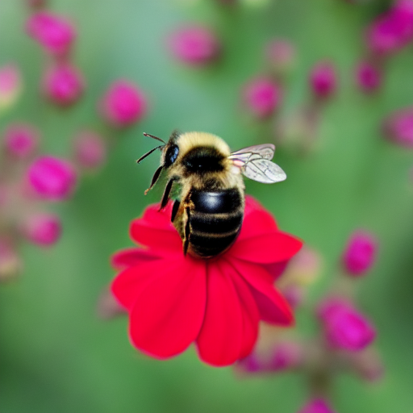|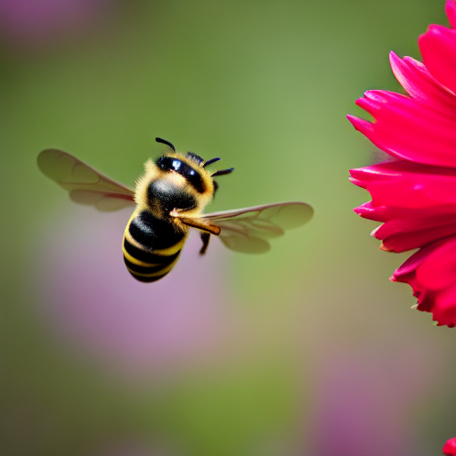|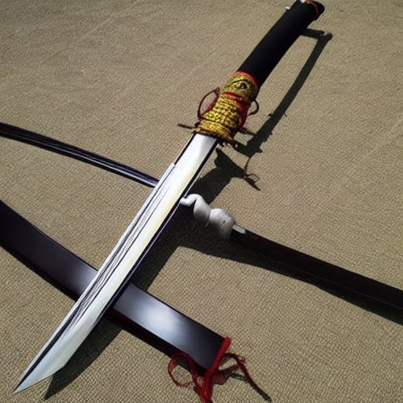|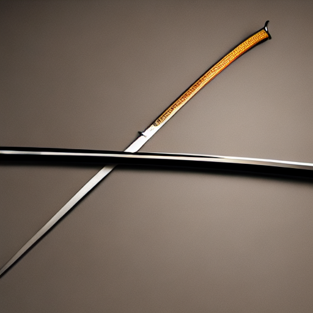

Popularidade

| pencil drawing of a young man | pencil drawing of a young man, trending on artstation | A ballerina by the window and a city skyline in the background | A ballerina by the window and a city skyline in the background, award winning photo | 
|---|---|---|---|
|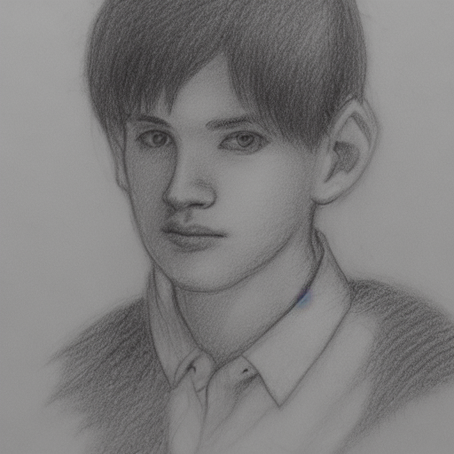|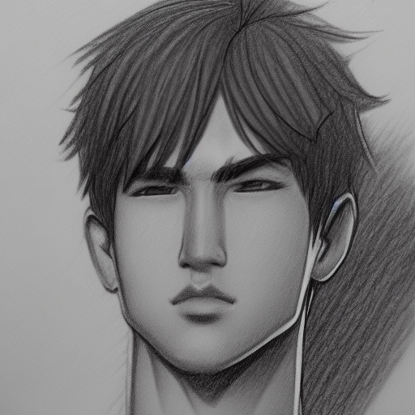|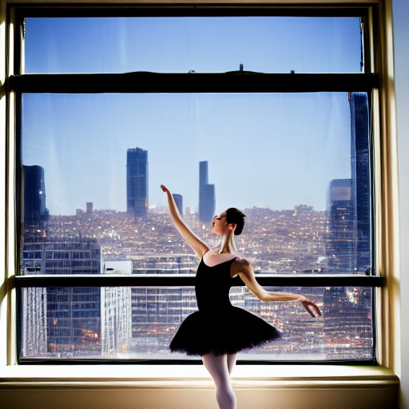 | 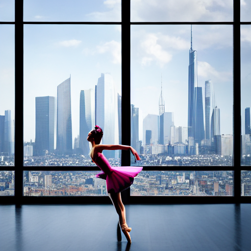

</blockquote></details>

---
### Parâmetros de Geração de Imagem
CFG - Classifier Free Guidance
<br>
Quanto menor o valor, mais liberdade a IA tem para gerar uma imagem.

Prompt: A blue monkey holding a red ball, 3D render

| CFG: 1 | CFG: 5 | CFG: 15 | CFG: 21| CFG: 30 
|---|---|---|---|---|
|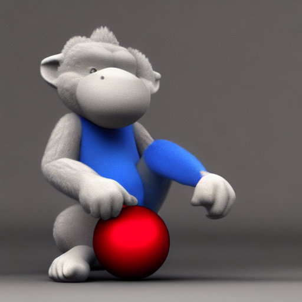|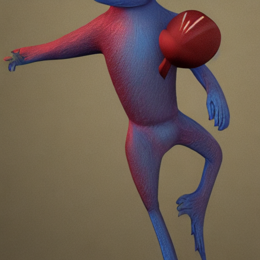|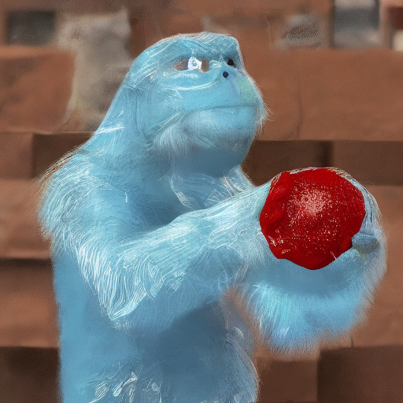|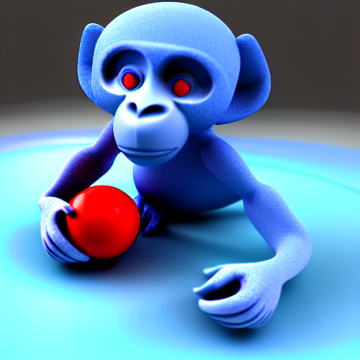 |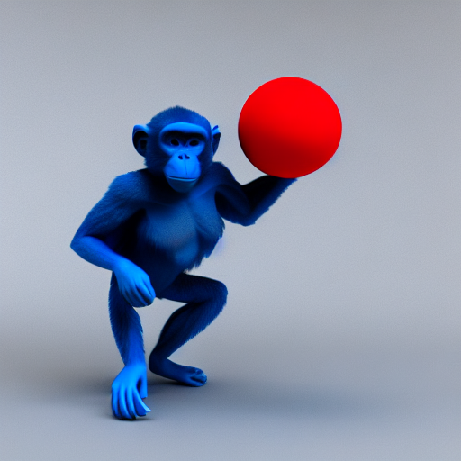

Contador de Passos de Amostragem
<br>
Quanto maior o valor, maior a definição da imagem e mais tempo para gerar.

Prompt: A blue monkey holding a red ball, 3D render
| Passos: 1 | Passos: 5 | Passos: 10 | Passos: 20 | Passos: 30 | Passos: 50 | Passos: 100 | Passos: 150 
|---|---|---|---|---|---|---|---|
|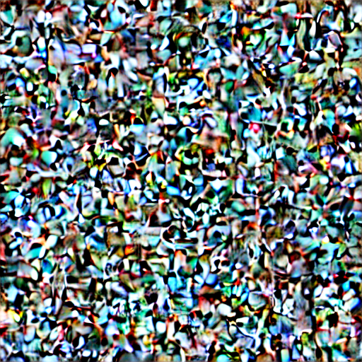|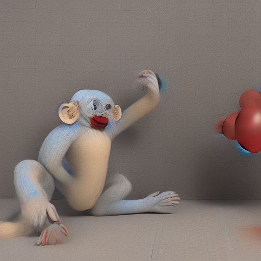|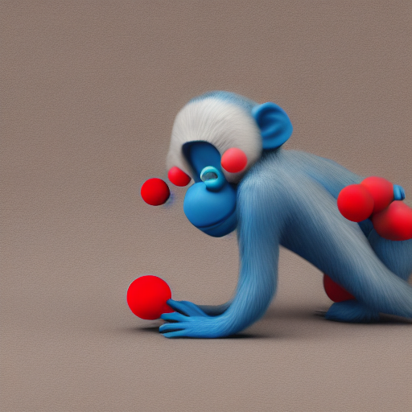|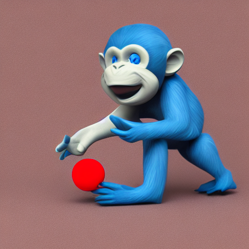|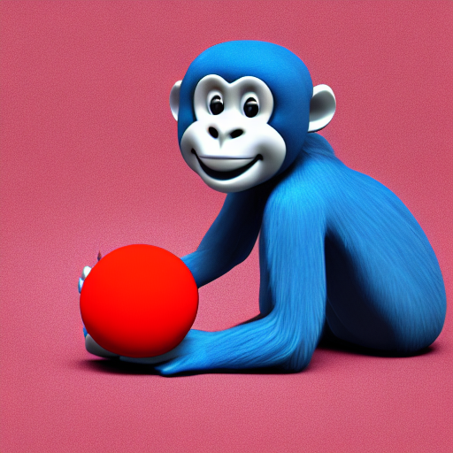|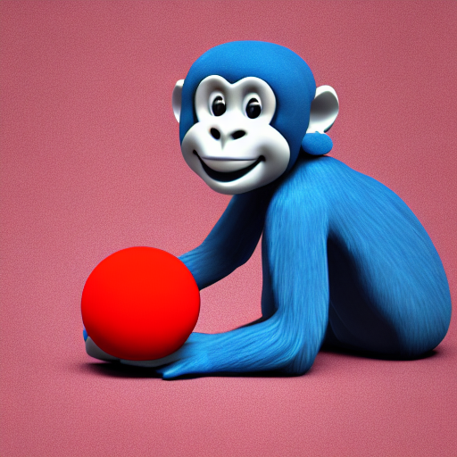|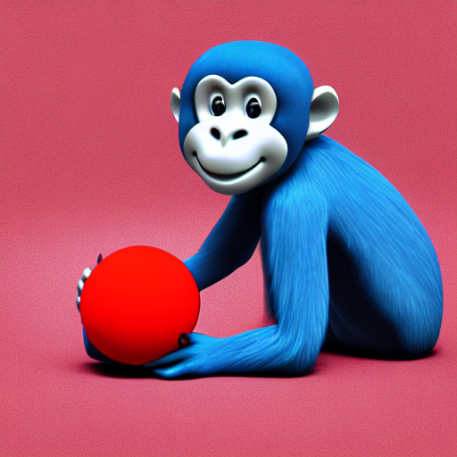|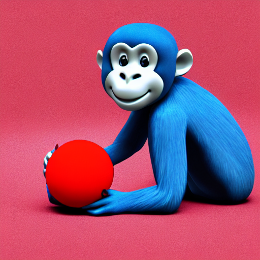

Seed
<br>
É o valor do ruído inicial de onde a imagem será gerada. Se você deixar com apenas 1 passo, é uma aproximação do ruído inicial referente àquela seed.

Prompt: A blue monkey holding a red ball, 3D render
| Seed: 2148213317 | Seed: 3534937562 | Seed: 2325907017 | Seed: 3915754044 | 
|---|---|---|---|
||||


Tipos de Amostragem
<br>
É o metodo usado para os passos da geração de imagens.

Prompt: A blue monkey holding a red ball, 3D render
<br> Seed: 3915754044
<br> CFG: 10
<br> Passos: 20

|Euler a | Euler | LMS | Heun | 
|---|---|---|---|
||||

Prompt: A blue monkey holding a red ball, 3D render
<br> Seed: 3915754044
<br> CFG: 10
<br> Passos: 20

| DPM2 | DPM2 a | DPM++ 2S a | DPM++ 2M | 
|---|---|---|---|
||||

Prompt: A blue monkey holding a red ball, 3D render
<br> Seed: 3915754044
<br> CFG: 10
<br> Passos: 20

|DPM  fast | DPM adaptive | LMS Karras | DPM2 Karras | 
|---|---|---|---|
||||

Prompt: A blue monkey holding a red ball, 3D render
<br> Seed: 3915754044
<br> CFG: 10
<br> Passos: 20

| DPM2 a Karras | DPM++ 2S a Karras | DPM++ 2M Karras | DDIM | PLMS |
|---|---|---|---|---
|||||

Eficiência de Tokens
<br>
O prompt é limitado a 75 tokens (mais ou menos 75 palavras).
<br> Seed: 2282239514
<br> CFG: 12,5
<br> Passos: 50
<br> Amostragem: Euler a

Prompt: A blue monkey holding a red ball, 3D render
| A giant blue monkey holding a little red ball with green and yellow patterns, 3D render, by Greg Rutkowski, Unreal Engine render, Black background, vibrant colors, highly detailed, intricate | A giant blue monkey holding a little red ball with green and yellow patterns, 3D render, by Greg Rutkowski, Unreal Engine render, Black background, vibrant colors, highly detailed | A giant blue monkey holding a little red ball with green and yellow patterns, 3D render, by Greg Rutkowski, Unreal Engine render, Black background, vibrant colors |A giant blue monkey holding a little red ball with green and yellow patterns, 3D render, by Greg Rutkowski, Unreal Engine render, Black background | A giant blue monkey holding a little red ball with green and yellow patterns, 3D render, by Greg Rutkowski, Unreal Engine render | A giant blue monkey holding a little red ball with green and yellow patterns, 3D render, by Greg Rutkowski | A giant blue monkey holding a little red ball with green and yellow patterns, 3D render | A giant blue monkey holding a little red ball, 3D render 
|---|---|---|---|---|---|---|---|
||||||||

---


<h3>Para usar depois</h3>

  Heading com summary
<div>
 <h3><details closed><summary><b>Título do heading</b></summary><blockquote>
  <details><summary>Summary 1</summary><blockquote>
     Lista 1
  </blockquote></details>
  <details><summary>Summary 2</summary><blockquote>
     Lista 2 
  <blockquote>  
  </blockquote></details>
      
</blockquote></details>
 </div>
   
Contorno de tabela

<table>
<tr>
<td>

</td>
</tr>
</table>

Sumários inception

<details closed><summary>nome topo</summary><blockquote>
     <details><summary>nome interno inicial 1</summary><blockquote>
     Nome interno final 1
  </blockquote></details>
     <details closed><summary>nome interno inicial 2</summary><blockquote>
     Nome interno final 2
  </blockquote></details>
  </blockquote></details>

<details><summary>CLICK ME</summary>
<p>

#### We can hide anything, even code!

```ruby
   puts "Hello World"
```

</p>
</details>
